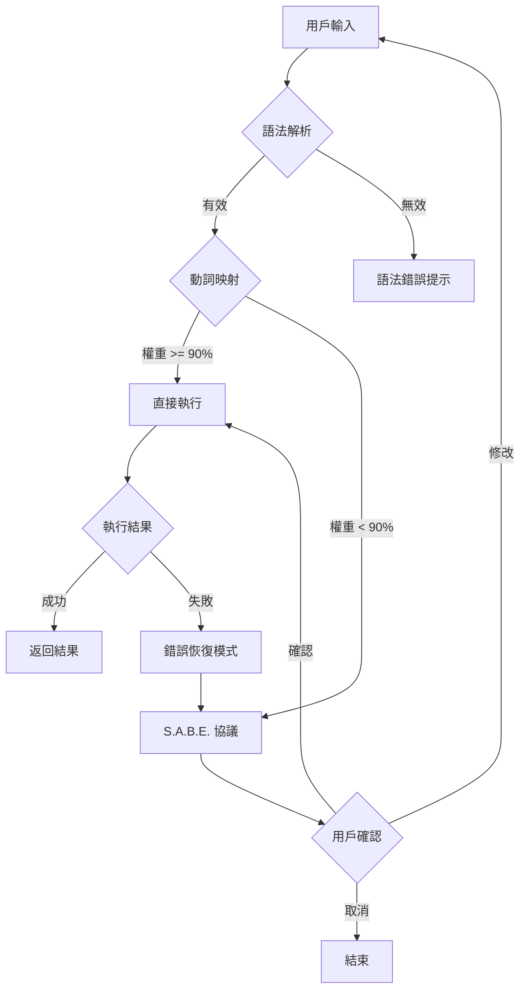

# SAD System (SLASH@DASH) 設計文件

## 一、核心設計原則：用法嚴格，用字寬容

本系統的基礎設計原則，旨在確保系統穩定解析的同時，最大化使用者輸入的彈性。

| 維度 | 規則 | 說明 |
|------|------|------|
| 用法（語法） | 絕對嚴格 | 語法結構必須固定不變，是系統解析的基礎規範：`/指令名 @輸入 --參數 值` |
| 用字（語意） | 寬容映射 | 接受動詞同義詞，並透過權重判斷自動映射到單一標準指令 |
| 例外處理 | S.A.B.E. 協議 | 處理所有無法自動映射、高風險或複雜的任務 |

---

## 二、語法結構

### 基本格式

```
/指令名 @輸入 --參數 值
```

### 組成部分

| 部分 | 格式 | 必填 | 說明 |
|------|------|------|------|
| 指令名 | `/verb-noun` | ✅ | 動詞-名詞格式，使用連字號連接 |
| 輸入 | `@type:id` | 可選 | 輸入對象，格式為類型:識別符 |
| 參數 | `--key value` | 可選 | 鍵值對參數，可多個 |

### 範例

```bash
# 完整格式
/analyze-data @file:sales.csv --type summary --format markdown

# 最小格式
/list-files

# 多參數
/generate-report @data:q4 --template executive --format pdf --lang zh-TW
```

---

## 三、寬容映射表與動詞識別邏輯

系統利用高權重同義詞庫，實現自然語言到程式化指令的智能轉換。

### 映射規則

| 標準指令 | 寬容同義詞 | 映射結果 | 核心功能類別 |
|---------|-----------|---------|-------------|
| `/analyze-data` | analyze, inspect, examine, investigate | ✅ | 數據分析 |
| `/summarize-doc` | summarize, digest, condense, brief | ✅ | 文件操作 |
| `/convert-file` | convert, transform, change | ✅ | 文件操作 |
| `/generate-site` | generate, create, build | ✅ | 網頁部署 |

### 權重計算

```python
def calculate_weight(input_verb: str, target_verb: str) -> float:
    """
    計算輸入動詞與目標動詞的相似度權重
    
    Returns:
        float: 0-100 的權重分數
    """
    # 精確匹配
    if input_verb == target_verb:
        return 100.0
    
    # 同義詞匹配
    if input_verb in synonyms[target_verb]:
        return synonyms[target_verb][input_verb]
    
    # 模糊匹配（觸發 S.A.B.E.）
    return calculate_fuzzy_match(input_verb, target_verb)
```

### 閾值設定

- **直接映射閾值**: 90%
- **S.A.B.E. 觸發閾值**: < 90%
- **拒絕閾值**: < 30%

---

## 四、S.A.B.E. 協議 (Suggest & Ask Before Exec)

### 協議定義

在執行任何具有歧義、風險或不可逆的操作前，系統必須先**提出建議 (Suggest)** 並**徵求用戶確認 (Ask)**。

### 觸發條件

| 條件 | 說明 | 範例 |
|------|------|------|
| 動詞模糊 | 動詞無法高機率映射 | `/figure-out @data` |
| 輸入異常 | @input 不存在或格式不符 | `@file:invalid_id` |
| 高風險操作 | 不可逆指令 | `/deploy`, `/delete` |
| 大型任務 | Token > 50k 或步驟 > 5 | 完整工作流程 |
| 錯誤後續 | 前一指令失敗 | 連續錯誤處理 |

### 交互模式

#### 模式 A: 模糊指令修復

```
🛑 S.A.B.E. 協議觸發 - 指令解析確認

指令: /figure-out @data:sales
問題: 動詞 "figure-out" 無法確定映射

🔍 智能建議:
1. /analyze-data (詳細分析)
2. /visualize-chart (圖表生成)
3. /summarize-doc (摘要生成)

❓ 請選擇 1, 2, 3 或輸入新指令
```

#### 模式 B: 錯誤自動恢復

```
🛑 S.A.B.E. 協議觸發 - 錯誤恢復

指令: /analyze @file:invalid_id
錯誤: 檔案 ID 不存在

🔍 智能建議:
1. 使用最近檔案: @file:191
2. 上傳新檔案
3. 列出可用檔案

❓ 是否使用 @file:191 執行？(Y/N)
```

#### 模式 C: 大型任務確認

```
🛑 S.A.B.E. 協議觸發 - 大型任務確認

指令: /full-workflow @file:164 --complete
預估: 12 步驟, ~150k tokens

📋 工作流程:
1. 提取數據
2. 清理格式
3. 分析趨勢
...
12. 部署報告

❓ 確認執行？(Y/修剪/取消)
```

---

## 五、架構圖



---

## 六、未來擴展

### 計畫中功能

- [ ] `/list-outputs` - 歷史輸出索引
- [ ] `/retrieve-output` - 輸出檢索
- [ ] `/share-link` - 分享連結生成
- [ ] `/share-workspace` - 團隊協作
- [ ] `/version-control` - 版本控制

### 插件系統

系統設計支援插件擴展，允許第三方開發者註冊新指令：

```python
from sad import register_command

@register_command(
    name="custom-analysis",
    synonyms=["custom", "special"],
    category="自定義"
)
def custom_analysis(input_obj, **params):
    # 自定義邏輯
    pass
```
