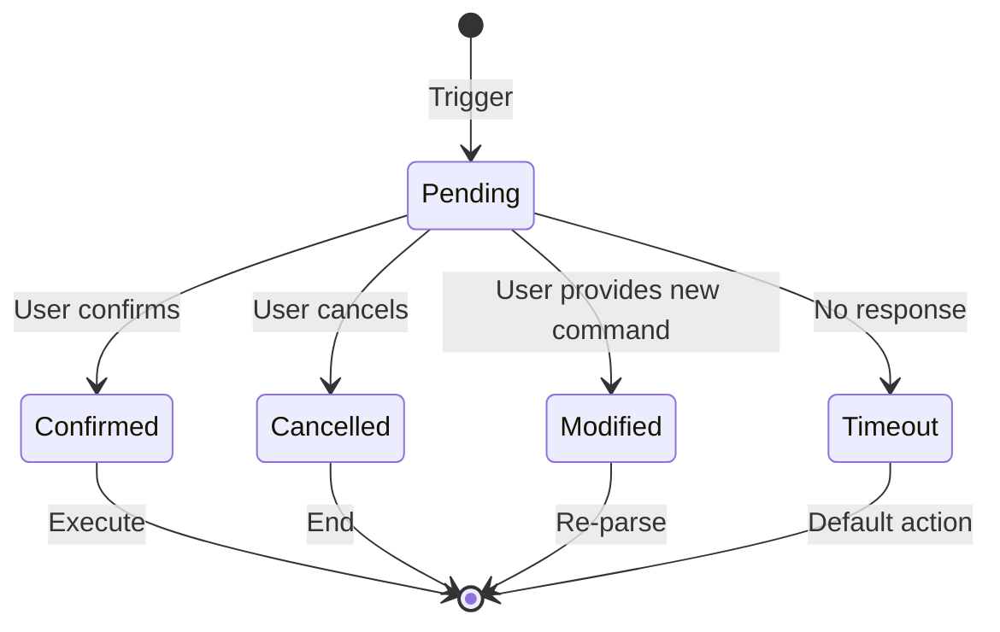

# S.A.B.E. Protocol Specification
# S.A.B.E. 協議規範

> **S**uggest & **A**sk **B**efore **E**xec  
> 建議並確認後執行

---

## Overview | 概述

**EN**: The S.A.B.E. protocol is the safety layer of SAD System that ensures zero-error automation by requiring user confirmation before executing ambiguous, risky, or complex operations.

**中文**: S.A.B.E. 協議是 SAD System 的安全層，通過在執行模糊、高風險或複雜操作前要求用戶確認，確保零錯誤自動化。

---

## Trigger Conditions | 觸發條件

### Mode A: Ambiguous Verb Repair | 模糊動詞修復

**Trigger | 觸發**: Mapping confidence < 90%

```
🛑 S.A.B.E. Protocol Triggered - Command Parsing
   S.A.B.E. 協議觸發 - 指令解析確認

Command | 指令: /figure-out @data:sales
Issue | 問題: Verb "figure-out" cannot be mapped with high confidence
              動詞 "figure-out" 無法高置信度映射

🔍 Suggestions | 智能建議:
1. /analyze-data (Detailed analysis | 詳細分析)
2. /visualize-chart (Chart generation | 圖表生成)
3. /summarize-doc (Summary generation | 摘要生成)

❓ Please select 1, 2, 3 or enter a new command
   請選擇 1, 2, 3 或輸入新指令
```

### Mode B: Error Recovery | 錯誤恢復

**Trigger | 觸發**: Invalid input or file not found

```
🛑 S.A.B.E. Protocol Triggered - Error Recovery
   S.A.B.E. 協議觸發 - 錯誤恢復

Command | 指令: /analyze-data @file:invalid_id
Error | 錯誤: File ID does not exist | 檔案 ID 不存在

🔍 Suggestions | 智能建議:
1. Use recent file | 使用最近檔案: @file:191
2. Upload new file | 上傳新檔案
3. List available files | 列出可用檔案

❓ Use @file:191 to execute? | 是否使用 @file:191 執行？ (Y/N)
```

### Mode C: Large Task Confirmation | 大型任務確認

**Trigger | 觸發**: Estimated tokens > 50,000 OR steps > 5

```
🛑 S.A.B.E. Protocol Triggered - Large Task Confirmation
   S.A.B.E. 協議觸發 - 大型任務確認

Command | 指令: /full-workflow @file:164 --complete
Estimate | 預估: 12 steps | 12 步驟, ~150k tokens

📋 Workflow | 工作流程:
1. Extract data | 提取數據
2. Clean format | 清理格式
3. Analyze trends | 分析趨勢
...
12. Deploy report | 部署報告

❓ Confirm execution? | 確認執行？ (Y / Trim | 修剪 / Cancel | 取消)
```

### Mode D: High Risk Confirmation | 高風險確認

**Trigger | 觸發**: Destructive operations (delete, deploy, destroy)

```
🛑 S.A.B.E. Protocol Triggered - High Risk Operation
   S.A.B.E. 協議觸發 - 高風險操作

Command | 指令: /delete-file @file:important.txt

⚠️ WARNING | 警告:
This operation is IRREVERSIBLE | 此操作不可逆
File will be permanently deleted | 檔案將被永久刪除

🔒 Safety Options | 安全選項:
1. Confirm deletion | 確認刪除
2. Create backup first | 先建立備份
3. Cancel | 取消

❓ Type 'DELETE' to confirm | 輸入 'DELETE' 確認
```

### Mode E: Input Missing | 輸入缺失

**Trigger | 觸發**: Required input not provided

```
🛑 S.A.B.E. Protocol Triggered - Input Required
   S.A.B.E. 協議觸發 - 需要輸入

Command | 指令: /analyze-data --format markdown
Issue | 問題: Missing @input | 缺少 @input

🔍 Recent Files | 最近檔案:
1. @file:sales.csv (2 min ago | 2 分鐘前)
2. @file:report.pdf (1 hour ago | 1 小時前)
3. @file:data.json (yesterday | 昨天)

❓ Select a file or provide @input
   請選擇檔案或提供 @input
```

---

## Response Handling | 回應處理

### User Responses | 用戶回應

| Input | 輸入 | Action | 動作 |
|-------|------|--------|------|
| `1`, `2`, `3`... | Select suggestion | 選擇建議 |
| `Y` / `yes` | Confirm | 確認 |
| `N` / `no` / `cancel` | Cancel | 取消 |
| `/new-command` | New command | 新指令 |
| `skip` | Skip this check | 跳過此檢查 |

### Status Flow | 狀態流程



---

## Configuration | 配置

```yaml
# thresholds.yaml
sabe:
  large_task_tokens: 50000     # Token threshold | Token 閾值
  large_task_steps: 5          # Step threshold | 步驟閾值
  max_suggestions: 5           # Max suggestions | 最大建議數
  auto_recovery_attempts: 3    # Auto recovery attempts | 自動恢復嘗試次數

high_risk_commands:
  - deploy
  - delete
  - destroy
  - remove
  - publish
  - overwrite
```

---

## Integration with Five Hacks | 與五言絕句整合

S.A.B.E. protocol integrates seamlessly with Five Prompt Hacks:

| Scenario | 場景 | Behavior | 行為 |
|----------|------|----------|------|
| Large task (60% mark) | 大型任務 (60%) | Self-grade hack auto-injected | 自動注入自評 hack |
| High risk (80%+ mark) | 高風險 (80%+) | 3-Expert + Devil's Advocate | 三專家 + 自我批判 |
| Error recovery | 錯誤恢復 | Clarify hack suggested | 建議先澄清 hack |

---

## Best Practices | 最佳實踐

1. **Always review suggestions** | 總是審閱建議
2. **Use backup for high-risk ops** | 高風險操作先備份
3. **Trim large tasks when possible** | 盡可能精簡大型任務
4. **Provide specific inputs** | 提供明確的輸入

---

*S.A.B.E. - Your safety net for AI automation*  
*S.A.B.E. - AI 自動化的安全網*
